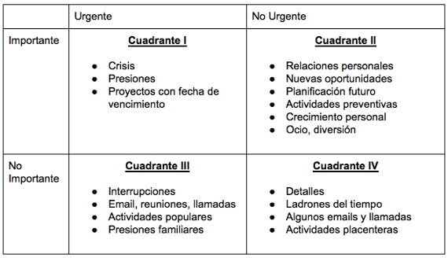

# Exámen final

## Índice

- [Exámen final](#exámen-final)
  - [Índice](#índice)
  - [Entornos VUCA](#entornos-vuca)
    - [Definición de los entornos VUCA](#definición-de-los-entornos-vuca)
      - [Volatilidad](#volatilidad)
      - [Incertidumbre](#incertidumbre)
      - [Complejidad](#complejidad)
      - [Ambiguedad](#ambiguedad)
    - [Cómo los entornos VUCA afectan a las organizaciones y su capacidad para adaptarse](#cómo-los-entornos-vuca-afectan-a-las-organizaciones-y-su-capacidad-para-adaptarse)
    - [Estrategías para enfrentar los entornos VUCA](#estrategías-para-enfrentar-los-entornos-vuca)
  - [Industría 4.0](#industría-40)
    - [Pilares industría 4.0](#pilares-industría-40)
      - [Automatización](#automatización)
      - [Análisis de datos](#análisis-de-datos)
      - [Tecnología de la información](#tecnología-de-la-información)
      - [Inteligecia artificial](#inteligecia-artificial)
    - [Casos de éxito](#casos-de-éxito)
      - [BMW](#bmw)
      - [Airbus](#airbus)
  - [Entornos Multigeneracionales](#entornos-multigeneracionales)
    - [Generaciones](#generaciones)
      - [Baby Boomers (nacidos entre 1946 y 1964)](#baby-boomers-nacidos-entre-1946-y-1964)
      - [Generación X (nacidos entre 1965 y 1980)](#generación-x-nacidos-entre-1965-y-1980)
      - [Los Millennials (nacidos entre 1981 y 1996)](#los-millennials-nacidos-entre-1981-y-1996)
      - [La Generación Z](#la-generación-z)
  - [Proceso administrativo](#proceso-administrativo)
    - [Planificación](#planificación)
    - [Organización](#organización)
    - [Dirección](#dirección)
    - [Control](#control)
    - [Habilidades gerenciales](#habilidades-gerenciales)
      - [Algunas de las habilidades gerenciales importantes para la industria 4.0 son](#algunas-de-las-habilidades-gerenciales-importantes-para-la-industria-40-son)
        - [Pensamiento estratégico](#pensamiento-estratégico)
        - [Habilidad para liderar equipos multigeneracionales](#habilidad-para-liderar-equipos-multigeneracionales)
        - [Conocimientos en tecnología](#conocimientos-en-tecnología)
        - [Habilidad para adaptarse a cambios constantes](#habilidad-para-adaptarse-a-cambios-constantes)
        - [Habilidad para tomar decisiones basadas en datos](#habilidad-para-tomar-decisiones-basadas-en-datos)
        - [Habilidad para fomentar la innovación](#habilidad-para-fomentar-la-innovación)
    - [Liderazgo y Gerencia](#liderazgo-y-gerencia)
    - [CIO (Chief Information Officer)](#cio-chief-information-officer)
    - [CEO (Chief Executive Officer)](#ceo-chief-executive-officer)
    - [Tic y gestión del conocimiento](#tic-y-gestión-del-conocimiento)
      - [Etapas de la gestión de conocimiento](#etapas-de-la-gestión-de-conocimiento)
        - [Identificación y captura del conocimiento](#identificación-y-captura-del-conocimiento)
        - [Organización y estructuración del conocimiento](#organización-y-estructuración-del-conocimiento)
        - [Almacenamiento y gestión del conocimiento](#almacenamiento-y-gestión-del-conocimiento)
        - [Compartir y transferir el conocimiento](#compartir-y-transferir-el-conocimiento)
        - [Uso y aplicación del conocimiento](#uso-y-aplicación-del-conocimiento)
  - [Sistema de información en las organizaciones](#sistema-de-información-en-las-organizaciones)
  - [BMPN  (Business Process Model and Notation)](#bmpn--business-process-model-and-notation)
    - [Desglose de BPMN](#desglose-de-bpmn)
  - [Fuentes](#fuentes)

## Entornos VUCA

### Definición de los entornos VUCA

Un entorno VUCA es un término acuñado por el ejército de los Estados Unidos para describir situaciones o contextos que son Volátiles, Inciertos, Complejos y Ambiguos. Esta noción se ha extendido más allá del ámbito militar y se aplica en diversos sectores, incluyendo los negocios y la gestión empresarial.

#### Volatilidad

Se refiere a la naturaleza impredecible y dinámica del entorno. Los cambios ocurren rápidamente y pueden ser disruptivos, lo que dificulta la planificación y la toma de decisiones.

#### Incertidumbre

Hace referencia a la falta de información o conocimiento completo sobre una situación. Existen múltiples escenarios posibles y es difícil predecir el resultado o las consecuencias de las acciones tomadas.

#### Complejidad

Se refiere a la interconexión de factores y variables en un sistema. Los problemas y desafíos son intrincados y están influenciados por múltiples elementos, lo que dificulta la comprensión y la búsqueda de soluciones claras.

#### Ambiguedad

Implica la falta de claridad o interpretación múltiple de la información disponible. Las situaciones pueden ser confusas y las señales pueden ser contradictorias, lo que dificulta la toma de decisiones informadas.

### Cómo los entornos VUCA afectan a las organizaciones y su capacidad para adaptarse

- **Toma de decisiones**: En entornos VUCA, la toma de decisiones se vuelve más desafiante debido a la volatilidad, incertidumbre, complejidad y ambigüedad. La falta de información completa y la rápida evolución de las circunstancias dificultan la toma de decisiones informadas y a largo plazo. Las organizaciones deben ser capaces de tomar decisiones rápidas y flexibles, incluso en situaciones de incertidumbre.

- **Planificación estratégica**: Los entornos VUCA requieren un enfoque de planificación estratégica más ágil y adaptable. Las organizaciones deben ser capaces de revisar y ajustar sus planes estratégicos con mayor frecuencia para responder a los cambios inesperados en el entorno. La planificación a largo plazo puede volverse menos efectiva, y las organizaciones deben adoptar enfoques más flexibles y orientados al corto plazo.

- **Innovación y adaptabilidad**: Los entornos VUCA pueden impulsar la necesidad de una mayor innovación y adaptabilidad en las organizaciones. Las empresas deben ser capaces de adaptarse rápidamente a las nuevas circunstancias, identificar oportunidades emergentes y encontrar soluciones creativas a los desafíos. Aquellas organizaciones que sean capaces de innovar y adaptarse tendrán una ventaja competitiva en entornos VUCA.

- **Gestión del cambio**: La gestión del cambio se vuelve crucial en los entornos VUCA. Las organizaciones deben ser capaces de comunicar eficazmente los cambios, involucrar a los empleados y ayudarles a adaptarse a nuevas situaciones. La resistencia al cambio puede ser más pronunciada en entornos VUCA, por lo que la gestión del cambio se convierte en un elemento esencial para el éxito de la organización.

- **Desarrollo de habilidades**: Los entornos VUCA demandan nuevas habilidades y competencias de los empleados. Las organizaciones deben fomentar el desarrollo de habilidades como la flexibilidad, la resiliencia, la capacidad de aprendizaje rápido y la colaboración efectiva. Los empleados necesitan estar preparados para hacer frente a situaciones cambiantes y complejas, y las organizaciones deben invertir en su desarrollo profesional y personal.

### Estrategías para enfrentar los entornos VUCA

- **Flexibilidad y agilidad**: La flexibilidad y la agilidad son fundamentales para adaptarse rápidamente a los cambios en los entornos VUCA. Las organizaciones deben estar dispuestas a ajustar sus planes, procesos y estructuras en respuesta a las nuevas circunstancias. Esto implica ser receptivos a la retroalimentación del entorno, ser capaces de cambiar de dirección cuando sea necesario y fomentar una cultura de innovación y mejora continua.

- **Planificación estratégica adaptable**: En lugar de confiar en planes estratégicos a largo plazo, las organizaciones deben adoptar enfoques de planificación más flexibles y adaptables. Esto implica una planificación basada en escenarios, donde se consideran diferentes posibilidades y se tienen planes de contingencia preparados. La capacidad de ajustar y reevaluar constantemente los planes estratégicos permitirá a las organizaciones responder de manera más efectiva a los cambios imprevistos.

- **Colaboración y trabajo en equipo**: La colaboración efectiva y el trabajo en equipo son esenciales en entornos VUCA. Las organizaciones deben fomentar la comunicación abierta y transparente, tanto interna como externamente. Esto permite compartir conocimientos, aprovechar la experiencia colectiva y generar ideas innovadoras. Además, promover la colaboración con socios, proveedores y clientes puede ayudar a abordar los desafíos compartidos y a aprovechar las oportunidades emergentes.

- **Enfoque en el aprendizaje y la mejora continua**: En entornos VUCA, es fundamental fomentar una cultura de aprendizaje y mejora continua. Las organizaciones deben alentar a sus empleados a adquirir nuevas habilidades, experimentar con nuevas ideas y aprender de los errores. Esto implica valorar el aprendizaje individual y organizacional, promover la retroalimentación constructiva y establecer mecanismos para compartir y difundir el conocimiento interno.

- **Anticipación y gestión del riesgo**: En entornos VUCA, la gestión del riesgo se vuelve aún más importante. Las organizaciones deben desarrollar la capacidad de anticipar posibles escenarios y evaluar los riesgos asociados. Esto implica realizar análisis de riesgos más exhaustivos, establecer sistemas de alerta temprana y estar preparados para tomar medidas rápidas y efectivas cuando surjan situaciones de riesgo.

- **Liderazgo fuerte y visionario**: En entornos VUCA, el liderazgo desempeña un papel crucial. Los líderes deben ser capaces de brindar una visión clara, inspirar a sus equipos y tomar decisiones difíciles en momentos de incertidumbre. Esto implica desarrollar habilidades de comunicación efectiva, empatía, adaptabilidad y toma de decisiones informadas.

[Volver al índice](#índice)

---

## Industría 4.0

Describe la integración de tecnologías digitales y avanzadas en los procesos de producción y manufactura. Esta revolución industrial se basa en la digitalización, la conectividad y la automatización de los sistemas de producción.

### Pilares industría 4.0

#### Automatización

es uno de los mayores beneficios de la Revolución Industrial y la Industria 4.0. Las empresas pueden utilizar robots y sistemas automatizados para realizar tareas repetitivas y mejorar la eficiencia. La automatización también puede reducir errores y aumentar la precisión en las operaciones.

#### Análisis de datos

Al aprovechar el análisis de datos y el aprendizaje automático, las empresas pueden obtener información valiosa sobre sus operaciones y procesos. Esto puede ayudar a mejorar la eficiencia y tomar decisiones informadas.

#### Tecnología de la información

Las empresas pueden utilizar tecnología como el Internet de las cosas (IoT) para monitorear y controlar los procesos en tiempo real. Esto permite a los gerentes tomar decisiones más informadas y optimizar los procesos.

#### Inteligecia artificial

juega un papel clave en la Industria 4.0 al impulsar la automatización inteligente, la toma de decisiones basada en datos y la optimización de procesos.

- Robótica avanzada
- Análisis de datos y pronósticos
- Personalización y experiencia del cliente
- Optimización de procesos
- Control de calidad

### Casos de éxito

#### BMW

 ha adoptado tecnologías de la Industria 4.0 en sus plantas de producción, utilizando la robótica avanzada, la realidad aumentada y la inteligencia artificial para optimizar los procesos de fabricación de automóviles. Han logrado una mayor flexibilidad en la producción, reducción de costos y una mejora en la calidad del producto.

#### Airbus

Airbus, el fabricante de aviones, ha aplicado la Industria 4.0 en sus procesos de producción, utilizando tecnologías de fabricación aditiva (impresión 3D), robótica colaborativa y análisis de datos para mejorar la eficiencia y la personalización en la fabricación de componentes aeroespaciales. Han logrado reducir los tiempos de producción y mejorar la calidad de los componentes.

[Volver al índice](#índice)

---

## Entornos Multigeneracionales

en la Industria 4.0 es común encontrar entornos multigeneracionales en el lugar de trabajo. Debido a la naturaleza tecnológica y digital de la Industria 4.0, se produce un cruce de diferentes generaciones que trabajan juntas en un entorno colaborativo.

### Generaciones

#### Baby Boomers (nacidos entre 1946 y 1964)

- **Valores clave**: Lealtad, dedicación al trabajo, disciplina.
- **Características**: Son conocidos por ser trabajadores comprometidos y dispuestos a hacer sacrificios por su carrera. Tienen una ética laboral fuerte y valoran la estabilidad y la seguridad en el trabajo. También suelen ser respetuosos con la autoridad y prefieren una comunicación más tradicional, como las reuniones cara a cara o las llamadas telefónicas.
  
#### Generación X (nacidos entre 1965 y 1980)

- **Valores clave**: Independencia, equilibrio entre vida laboral y personal, adaptabilidad.
- **Características**: Los miembros de la Generación X suelen ser autónomos y valoran su independencia en el trabajo. Son adaptables a los cambios y están dispuestos a aprender nuevas habilidades. Buscan un equilibrio entre su vida laboral y personal y tienden a ser más orientados a los resultados. También son conocidos por ser innovadores y tener una mentalidad emprendedora.

#### Los Millennials (nacidos entre 1981 y 1996)

- **Valores clave**: Flexibilidad, diversidad, propósito.
- **Características**: Los Millennials valoran la flexibilidad en el trabajo, como la posibilidad de trabajar de forma remota o tener horarios flexibles. Son una generación diversa y aprecian la inclusión y la igualdad de oportunidades. Buscan un propósito más allá del salario y valoran el impacto social y ambiental de su trabajo. Son nativos digitales y están cómodos con la tecnología y las redes sociales.

#### La Generación Z

- **Valores clave**: Tecnología, diversidad, autenticidad.
- **Características**: La Generación Z ha crecido en un mundo altamente digital y está totalmente inmersa en la tecnología. Son nativos digitales y utilizan la tecnología para la comunicación, el aprendizaje y el entretenimiento. Son una generación muy diversa y valoran la inclusión y la igualdad. También buscan la autenticidad en las marcas y las organizaciones, y prefieren trabajar en entornos que reflejen sus valores.

[Volver al índice](#índice)

---

## Proceso administrativo

El proceso administrativo juega un papel fundamental en la gestión organizacional, ya que proporciona una estructura sistemática y orientada a resultados para dirigir y coordinar las actividades de una organización.

### Planificación

Es la primera etapa del proceso administrativo y se refiere a establecer metas y objetivos, así como determinar las acciones necesarias para alcanzarlos.

En esta etapa, se analiza el entorno, se identifican los recursos disponibles y se desarrollan estrategias y planes de acción.

### Organización

Implica estructurar los recursos y las actividades de la organización de manera eficiente.

En esta etapa, se asignan responsabilidades, se establecen jerarquías y se crean sistemas y procesos de trabajo.

### Dirección

Se refiere a influir y guiar a los miembros de la organización para alcanzar los objetivos establecidos

En esta etapa, los líderes motivan, comunican, supervisan y toman decisiones que orientan a los empleados hacia la consecución de los objetivos organizacionales.

### Control

es la etapa final del proceso administrativo y se centra en monitorear y evaluar el desempeño de la organización para asegurarse de que se alcancen los objetivos establecidos.

En esta etapa, se establecen estándares de desempeño, se recopilan datos, se comparan los resultados reales con los esperados y se toman medidas correctivas cuando sea necesario.

### Habilidades gerenciales

Las habilidades gerenciales en la industria 4.0 son esenciales para liderar y administrar
equipos en un entorno empresarial cada vez más digitalizado y automatizado.

#### Algunas de las habilidades gerenciales importantes para la industria 4.0 son

- Pensamiento estratégico
- Habilidad para liderar equipos multigeneracionales
- Conocimientos en tecnología
- Habilidad para adaptarse a cambios constantes
- Habilidad para tomar decisiones basadas en datos
- Habilidad para fomentar la innovación
  
##### Pensamiento estratégico

los gerentes deben ser capaces de pensar a largo plazo y comprender cómo las nuevas tecnologías pueden ayudar a sus empresas a alcanzar objetivos estratégicos.

##### Habilidad para liderar equipos multigeneracionales

la industria 4.0 ha creado un entorno laboral diverso, en el que trabajan juntos personas de diferentes edades, experiencias y antecedentes. Los gerentes deben ser capaces de liderar y motivar a este tipo de equipos.

##### Conocimientos en tecnología

los gerentes deben estar familiarizados con las tecnologías de la industria 4.0, como el Internet de las cosas, la inteligencia artificial y la automatización, para poder aprovechar su potencial y tomar decisiones informadas.

##### Habilidad para adaptarse a cambios constantes

la industria 4.0 es un entorno de cambio constante, y los gerentes deben ser capaces de adaptarse rápidamente a los cambios en los mercados, las tecnologías y las tendencias.

##### Habilidad para tomar decisiones basadas en datos

la industria 4.0 genera grandes cantidades de datos, y los gerentes deben ser capaces de analizar y utilizar esta
información para tomar decisiones informadas.

##### Habilidad para fomentar la innovación

los gerentes deben ser capaces de fomentar la innovación en sus equipos y empresas, y de explorar nuevas formas de utilizar la tecnología para mejorar la eficiencia y la rentabilidad.

### Liderazgo y Gerencia

(**diapositivas de Elon Musk**)

### CIO (Chief Information Officer)

El CIO es el responsable de la gestión estratégica de la tecnología de la información en una organización.

- Supervisar y dirigir todas las actividades relacionadas con la tecnología de la información y los sistemas de información de la organización.
- Desarrollar y ejecutar la estrategia de tecnología de la información de la empresa, alineada con los objetivos y necesidades empresariales.
- Gestionar el presupuesto y los recursos tecnológicos de la organización.
- Evaluar y seleccionar tecnologías y soluciones adecuadas para mejorar la eficiencia y la productividad de la organización.
- Garantizar la seguridad de la información y la protección de datos.
- Colaborar con otros líderes empresariales para identificar oportunidades de innovación y aplicar tecnologías emergentes que impulsen el crecimiento y la ventaja competitiva.

### CEO (Chief Executive Officer)

El CEO es el máximo responsable ejecutivo de una organización y tiene un papel integral en el liderazgo estratégico y la toma de decisiones.

- Establecer la visión estratégica y los objetivos de la organización.
- Tomar decisiones estratégicas clave y liderar el desarrollo e implementación de la estrategia empresarial.
- Representar a la organización ante los stakeholders, como accionistas, clientes, empleados y socios externos.
- Gestionar el rendimiento financiero de la organización y asegurar su crecimiento y rentabilidad.
- Supervisar y colaborar con otros líderes y departamentos para garantizar la ejecución efectiva de la estrategia.
- Evaluar y gestionar los riesgos empresariales y tomar medidas para mitigarlos.
- Mantenerse actualizado sobre las tendencias y cambios en el entorno empresarial para adaptar la estrategia de la organización en consecuencia.

### Tic y gestión del conocimiento

(diapositivas de tic y gestión de conocimiento)

Se refiere a los procesos y actividades que una organización implementa para capturar, organizar, almacenar, compartir y utilizar el conocimiento de manera efectiva.

El conocimiento es un recurso valioso que impulsa la innovación, mejora el desempeño y proporciona ventajas competitivas a las organizaciones.

#### Etapas de la gestión de conocimiento

- Identificación y captura del conocimiento
- Organización y estructuración del conocimiento
- Almacenamiento y gestión del conocimiento
- Compartir y transferir el conocimiento
- Uso y aplicación del conocimiento

##### Identificación y captura del conocimiento

Consiste en identificar el conocimiento crítico dentro de la organización y capturarlo de diversas fuentes, como expertos, bases de datos, documentos, lecciones aprendidas, experiencias pasadas, etc. Esto se puede lograr a través de entrevistas, encuestas, reuniones, auditorías de conocimiento, entre otros métodos.

##### Organización y estructuración del conocimiento

Una vez capturado, el conocimiento debe ser organizado y estructurado de manera que sea fácilmente accesible y comprensible para los miembros de la organización. Esto implica categorizar el conocimiento en diferentes temas, crear bases de datos, utilizar sistemas de gestión de contenido, establecer taxonomías o utilizar herramientas tecnológicas adecuadas para su organización.

##### Almacenamiento y gestión del conocimiento

Una vez organizado, el conocimiento debe ser almacenado en una forma que sea fácilmente accesible. Esto puede incluir la creación de bases de datos, repositorios, wikis, intranets o sistemas de gestión del conocimiento que permitan a los empleados acceder y buscar información relevante cuando la necesiten

##### Compartir y transferir el conocimiento

La transferencia de conocimiento es esencial para aprovechar su valor. Las organizaciones deben fomentar la colaboración, el intercambio de experiencias y la comunicación abierta para promover el flujo de conocimiento entre los miembros. Esto puede lograrse a través de reuniones, sesiones de capacitación, comunidades de práctica, mentorías, herramientas de colaboración en línea, entre otros medios.

##### Uso y aplicación del conocimiento

El objetivo final de la gestión del conocimiento es utilizar el conocimiento de manera efectiva para mejorar la toma de decisiones, la resolución de problemas, la innovación y el desempeño organizacional en general. Esto implica fomentar una cultura de aprendizaje continuo, donde el conocimiento se aplique en la práctica y se incorpore en los procesos y actividades de la organización.

[Volver al índice](#índice)

---

## Sistema de información en las organizaciones

(**Diapositivas del video**)

[Volver al índice](#índice)

---

## BMPN  (Business Process Model and Notation)

Es un estándar de modelado de procesos empresariales que proporciona una notación gráfica para representar visualmente los diferentes pasos, actividades, eventos y flujos de un proceso.

### Desglose de BPMN

Para crear un diagrama BPMN se utiliza un conjunto de elementos básicos que se clasifican en estos tres grupos principales:

- Objetos de flujo (Círculos, rectángulos y diamantes que describen eventos o actividades específicas)
- Conectando objetos (Vinculado con objetos de flujo para denotar la dirección)
- Los carriles de natación (parecidos a los carriles de una piscina olímpica, organizan los objetos de flujo en varias categorías).
- Piscinas (Puede describir diferentes departamentos o empresas)
  
[Volver al índice](#índice)

---

## Fuentes

- [Entornos multigeneracionesl: Emily en paris](https://www.netflix.com/co/title/81037371)
- [bmw](https://t21.com.mx/automotriz/2020/02/28/bmw-innova-tecnologia-40-su-linea-produccion)
- [airbus](https://www.lantek.com/es/blog/la-transformacion-digital-de-airbus)
- [matriz steven covey](http://www.integramasmas.com/la-matriz-de-steven-covey-y-su-aplicacion-a-la-productividad/)
- [bpmn](https://www.processmaker.com/es/blog/bpmn-2-0-tutorial-and-examples/)

---
